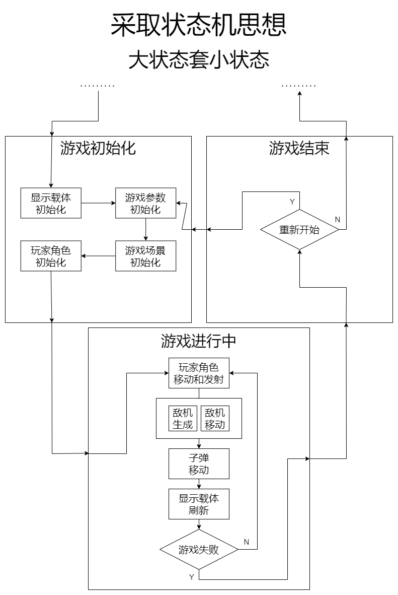

# 飞机大战简述 #

使用Cortex-M0+内核的STM32G030F6P6单片机制作一款蓝牙控制的飞机大战游戏。

# 蓝牙控制 #

通过手机APP与单片机蓝牙通信，以数据包的形式进行信息交换。

# 屏幕载体 #

以0.96寸IIC模式的OLED为屏幕。

# 游戏画面 #

目前游戏中有“背景”、“玩家角色”、“敌机”三种画面。

# 游戏设计思路 #

可以通过封装这三种内容，对它们分别管理，其中还需要考虑，如敌机对象有多个，如何同时管理多个敌机对象。

下方所展示的是整个游戏的运行逻辑：

